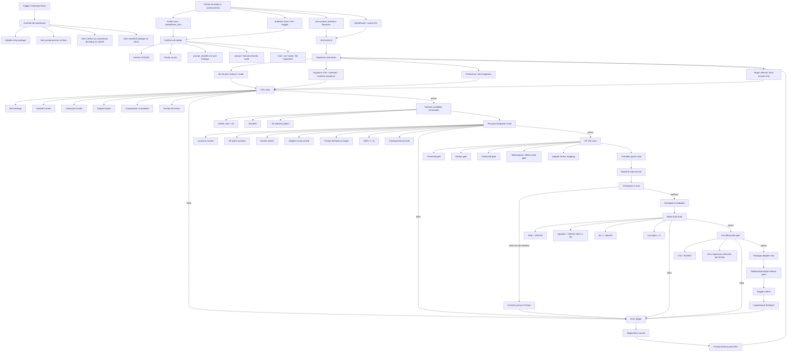

# KG1 Prediction Improvement Architecture

Atualizado: 2026-05-15

Objetivo: documentar o fluxo ponta a ponta usado para tentar melhorar a
predicao submit-safe das familias `equation_transform` e `bit_manipulation`,
sem violar o contrato adapter-only do desafio.

## Principio Central

Ganho so conta se aparecer em um adapter/package submetivel. Solver, verifier,
postprocessor, OpenRouter, literatura e scripts auxiliares sao permitidos como
diagnostico, geracao de hipotese, criacao de dataset e validacao, mas nao podem
ser dependencia runtime do submit.

## Arquitetura

## Componentes Obrigatorios

| Camada | Componente | Funcao |
|---|---|---|
| Regras | Contrato adapter-only | Impede que solver/verifier runtime vire submissao invalida |
| Dados | Hash/family/schema gates | Garante que o treino usa exatamente os dados esperados |
| Dados | Anti-leakage | Bloqueia uso de weak/full ou IDs proibidos em treino |
| Hipoteses | Literatura/OpenRouter/Kaggle | Gera ideias, mas nao promove nada sem gate local |
| CPU Gate | DSL/probes/audits | Prova sinal barato antes de GPU |
| Error Ledger | `KG1_ERROR_LEDGER_2026_05_15.md` | Guarda falhas, causas, regras preventivas e prompts externos |
| Integration Gate | `scripts/kg1_pre_paid_job_integration_gate.py` | Valida pecas, dataset, launcher e kill-switch antes de job pago |
| HF Job | H200 curto | Executa apenas smoke com limite de 1 hora |
| FinOps | Checkpoint 3 | Cancela cedo se a metrica interna piorar |
| Weak Gate | promover somente se `>192/315`, `equation>56/155`, `bit>=136/160`, `truncation=0`; alvo operacional `equation>=60/155` | Primeiro criterio real para promover checkpoint |
| Full Gate | package novo exige official-like `>=831/947` e `truncated<=4`; qualquer ranking delta precisa superar o historico `823/947` | Criterio final antes de package/submit |

## Estado Atual Das Linhas Historicas V439/V440

- Dataset V439: final-answer-only, `109` train, `24` validation.
- Train SHA: `bc032da2f7cada19aef295aa91aef6098e03c7b85215e7729f1ddd71b3e5079a`.
- Val SHA: `57321347f9293e9c0f2f17e6c9de1d88f1246fee4154125574b2e60251aee3a6`.
- V438 audit sobre V439: `hf_gpu_allowed_for_same_objective=true`.
- Integration gate local: aprovado, zero findings.
- HF job V440: H200, max `12` steps, checkpoint/eval no step `3`, timeout `3600s`.
- Resultado V440: checkpoint-3 empatou baseline interno `8/24`, equation `7/22`, bit `1/2`; job cancelado por FinOps.
- Status: linha historica fechada; nao repetir `mean_nll` final-answer-only.
- Proxima rota arquitetural ativa: CPU-only, criar dataset limpo novo somente
  depois de gate de simbolos/contradicoes/referencia; nenhum job GPU ativo.
- V447/V461/V463/V464/V468 e adapters V448/V465/V469 estao quarentenados e
  nao podem alimentar treino, eval, package ou submit.

## O Que Nao Promove Submit

- Loss/eval_loss isolado.
- Preference accuracy interna sem weak/full gain.
- Teacher/solver/verifier fora do adapter.
- Postprocessor ou runtime code.
- Dataset sem manifest, hash e gate.
- Mais epochs ou LR sweep sem novo sinal CPU.
