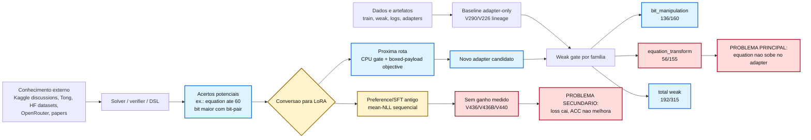
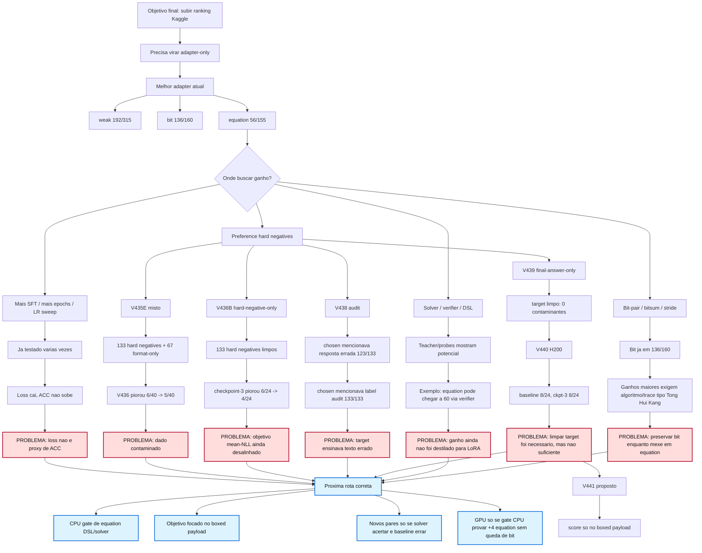

# KG1 Problem Map

Atualizado: 2026-05-15

Este documento mostra onde a solucao esta travando, quais evidencias temos e
por que a proxima acao nao deve ser "treinar mais", mas sim mudar o objetivo ou
o dado antes de gastar GPU novamente.

## Resumo Executivo

O problema atual nao e infraestrutura, GPU, hash, tokenizacao ou carregamento do
adapter. Esses pontos foram validados. O problema esta no **sinal de aprendizado
que chega ao LoRA**.

Estado real submit-safe:

| Metrica | Melhor adapter-only atual |
|---|---:|
| weak total | `192/315` |
| `equation_transform` | `56/155` |
| `bit_manipulation` | `136/160` |
| truncation | `0` |

O que ja sabemos:

- `bit_manipulation` ja esta forte no weak: `136/160`.
- `equation_transform` e o gargalo principal: `56/155`.
- V436/V436B/V440 provaram que preference `mean_nll` nao esta gerando ganho
  submit-safe.
- Solver/verifier/teacher mostrou potencial, mas esse ganho ainda nao foi
  convertido para adapter-only.
- Consulta OpenRouter V441 confirmou que o proximo smoke defensavel e trocar o
  score de preference para o payload dentro do `\boxed{...}`, com kill-switch
  no primeiro checkpoint.

## Desenho Simples Das Pecas Principais

Esta visao mostra somente as pecas centrais. O ponto critico esta entre
`conhecimento verificado` e `LoRA adapter`: hoje conseguimos encontrar respostas
potenciais fora do adapter, mas ainda nao conseguimos transformar isso em pesos
que melhorem o weak gate sem regressao.

## Desenho Do Problema

## Onde Estamos Com Problema

### 1. `equation_transform` e o gargalo real

O weak atual mostra:

- `bit_manipulation`: `136/160`, ja acima do gate minimo de `133`.
- `equation_transform`: `56/155`, abaixo da meta operacional de `60`.
- Total: `192/315`, ainda sem margem para promover full/package com seguranca.

Isso significa que o ranking nao vai subir apenas preservando bit. Precisamos
de pelo menos alguns acertos novos em equation, sem perder bit.

### 2. Loss baixo nao resolveu a metrica que importa

Observacao acumulada:

- varios treinos reduziram `train_loss` ou `eval_loss`;
- os acertos de `equation_transform` ficaram presos em torno de `56`;
- algumas variantes ainda derrubaram bit.

Conclusao: `loss` serve para detectar treino numericamente saudavel, mas nao
serve para promover checkpoint. O gate real segue sendo weak/full por familia.

### 3. Preference hard-negative falhou em duas formas

#### V436: dataset misto

O V435E antigo tinha:

- `133` hard negatives;
- `67` format-only negatives.

Resultado V436:

| Metrica interna | Baseline | Checkpoint inicial |
|---|---:|---:|
| preference total | `6/40` | `5/40` |
| equation | `4/22` | `3/22` |

Diagnostico: o dataset misturava negativos semanticamente errados com negativos
apenas de formato. Isso contaminava o sinal.

#### V436B: hard-negative-only

Corrigimos para apenas hard negatives:

- `133` pares;
- `120` equation;
- `13` bit.

Resultado:

| Metrica interna | Baseline | Checkpoint-3 |
|---|---:|---:|
| preference total | `6/24` | `4/24` |
| equation | `4/22` | `2/22` |
| bit | `2/2` | `2/2` |

Diagnostico: mesmo com dado sem format-only, o objetivo `mean_nll` ainda moveu
equation na direcao errada.

### 4. O target escolhido tambem estava contaminado

V438 audit encontrou:

| Check | Resultado |
|---|---:|
| labels boxed semanticamente corretos | `133/133` |
| rejected igual ao adapter wrong | `133/133` |
| chosen menciona adapter prediction errado | `123/133` |
| chosen menciona public-train label audit | `133/133` |

Diagnostico: o label final estava correto, mas o texto de treino ensinava coisas
ruins junto: mencionava auditoria e repetia a resposta errada.

### 5. V439 corrigiu o texto, mas V440 mostrou que isso nao basta

V439 final-answer-only removeu a contaminacao:

- chosen: `Final answer: \boxed{ANSWER}`;
- rejected: `Final answer: \boxed{ADAPTER_WRONG}`;
- `chosen_mentions_adapter_prediction_rows=0`;
- `chosen_mentions_public_train_label_audit_rows=0`.

V440 H200 validou toda a infraestrutura:

- integration gate local/remoto OK;
- HF dataset correto e hashes batendo;
- tokenizacao sem truncation;
- offset masks OK;
- adapter inicial V290 checkpoint-6 carregado `12011/12011`;
- trainable LoRA `8,015,872` parametros, `0.0247%`.

Resultado V440:

| Metrica interna V439 validation | Baseline V290 ckpt-6 | V440 checkpoint-3 |
|---|---:|---:|
| preference total | `8/24` | `8/24` |
| equation | `7/22` | `7/22` |
| bit | `1/2` | `1/2` |

Decisao: cancelado por FinOps. Nao houve sinal material para weak/full.

Diagnostico: limpar o target era necessario, mas o objetivo `mean_nll` sobre a
sequencia curta ainda nao e forte o bastante para converter os acertos desejados
em comportamento do adapter.

### 6. Consulta API sobre V441

Consulta feita em 2026-05-15 via OpenRouter:

- `deepseek/deepseek-v3.2`: V441 e tecnicamente justificado, mas com ressalva
  de que payload-only pode nao corrigir raciocinio.
- `qwen/qwen3.6-max-preview`: V441 e a correcao mecanica direta para a diluicao
  de sinal da V440.
- `google/gemini-3.1-pro-preview`: resposta truncada, mas iniciou validando a
  mesma tese de diluicao de sinal.

Conclusao: V441 pode ser rodado como smoke curto, desde que nao seja tratado
como ganho. Ele apenas testa se o problema era a diluicao da loss em tokens de
boilerplate.

Preflight local V441:

- Compile, gate estatico e gate pre-pago: OK.
- Tokenize-only dry-run: treino `109/109`, validacao `24/24`.
- Truncation e fallback de offset mask: `0`.
- Mascara de score no payload nao vazia: treino `chosen=339`, `rejected=376`;
  validacao `chosen=75`, `rejected=78`.

## O Que Isso Significa

O gargalo nao e "rodar mais H200". O gargalo e **como transformar conhecimento
verificado em gradiente util para o LoRA**.

Temos tres tipos de conhecimento:

1. `solver/verifier` consegue identificar alguns acertos potenciais;
2. literatura/discussion indica algoritmos fortes para bit e equation;
3. adapters atuais ja sabem muito, mas falham em subconjuntos especificos.

O que ainda falta:

1. isolar exatamente os subtipos de equation que podem ganhar `+4`;
2. gerar pares/traces onde a resposta correta seja aprendida sem ensinar texto
   estranho;
3. usar um objetivo que force o modelo a aumentar probabilidade do boxed payload
   correto, nao apenas reduzir NLL medio de uma sequencia inteira;
4. preservar `bit >= 136/160`.

## Proxima Acao Tecnica Correta

Nao repetir:

- V436;
- V436B;
- V440;
- mais epochs/LR sweep sobre o mesmo `mean_nll`;
- submit sem weak/full gain.

Executar agora:

1. CPU gate de `equation_transform` com DSL/solver:
   - focar `equation_numeric_operator_to_number`;
   - focar `equation_numeric_operator_to_symbolic`;
   - focar `equation_symbolic_sequence`;
   - focar `equation_symbolic_short`.
2. Medir se o solver/DSL encontra pelo menos `+4` equation em misses do
   baseline sem tocar em weak/full como treino.
3. Se existir sinal, gerar dataset de distilacao com:
   - prompt original;
   - final answer curto;
   - hard negative do adapter;
   - opcional trace deterministico curto somente se nao contaminar target.
4. Trocar objetivo de treino:
   - bloquear repeticao de `mean_nll` sequencial puro;
   - testar objetivo focado no boxed payload ou masked completion payload.
5. Rodar novo HF job somente se o CPU gate provar ganho potencial e o
   integration gate aprovar tudo.

## Criterio De Sucesso

Um candidato so avanca se:

- weak total `>192/315`;
- `equation_transform >56/155`, ideal `>=60/155`;
- `bit_manipulation >=136/160`;
- truncation `0`;
- depois full official-like `>823/947`.

Sem isso, o resultado volta para o error ledger e nao vira submit.
