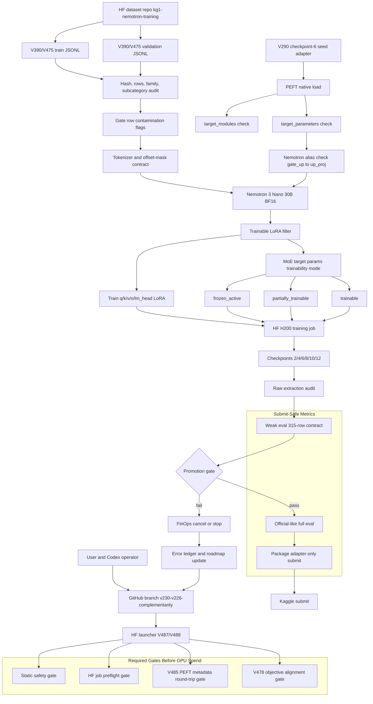
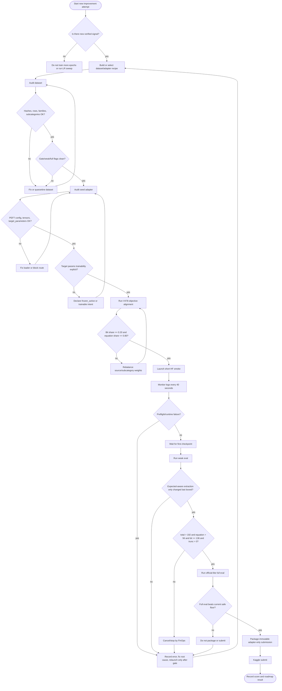
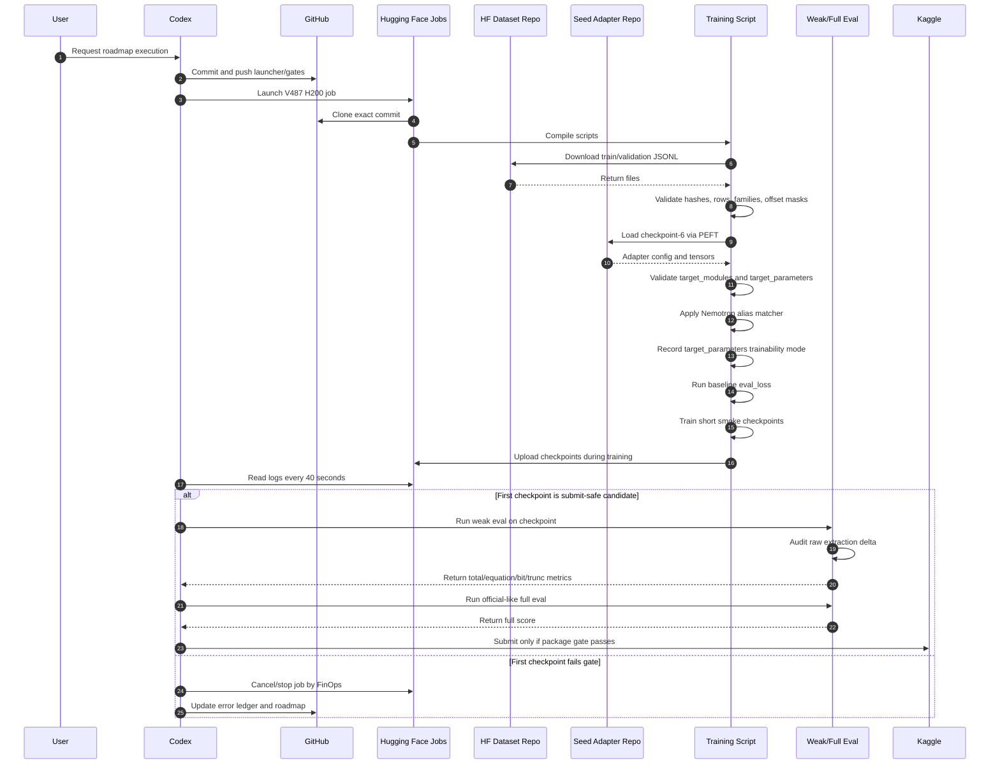
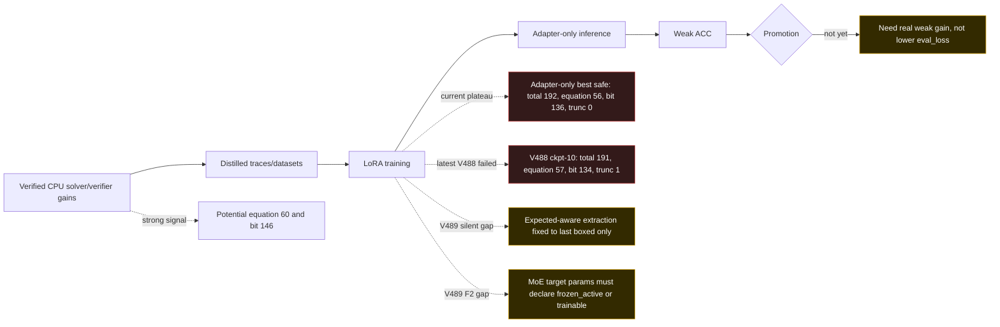

# KG1 Solution Architecture - Mermaid

Generated: 2026-05-16

This document shows the main moving parts used to improve KG1 predictions,
with emphasis on the current weak families:

- `bit_manipulation`
- `equation_transform`

Latest execution line: V487 H200 training proved the `target_parameters`
alias path, then V488 focused weak eval on `checkpoint-10` blocked promotion:
`191/315`, `equation_transform=57/155`, `bit_manipulation=134/160`,
`truncated=1`. The submit-safe floor remains V291/V290 checkpoint-6:
`192/315`, `equation_transform=56/155`, `bit_manipulation=136/160`,
`truncated=0`.

V489 audit update: the ACC verifier is strict, but two silent validation gaps
were corrected:

- expected-aware extraction may only disambiguate the last `\boxed{}` and now
  uses `verify_answer`;
- PEFT target-parameter observability now records whether MoE target parameters
  are `frozen_active`, `partially_trainable`, or `trainable`.
- SFT preflight now fails if row metadata marks gate/weak/full rows as used for
  training.

## Main Pieces

## Operational Flowchart

## Sequence Diagram

## Current Problem Boundary

The core issue is not that we lack CPU-solvable patterns. The issue is
transferring those patterns into an adapter-only submission without relying on
runtime solvers, postprocessors, constrained decoding, or leaked labels.
