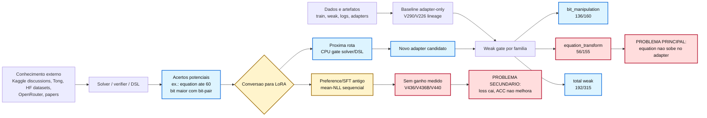
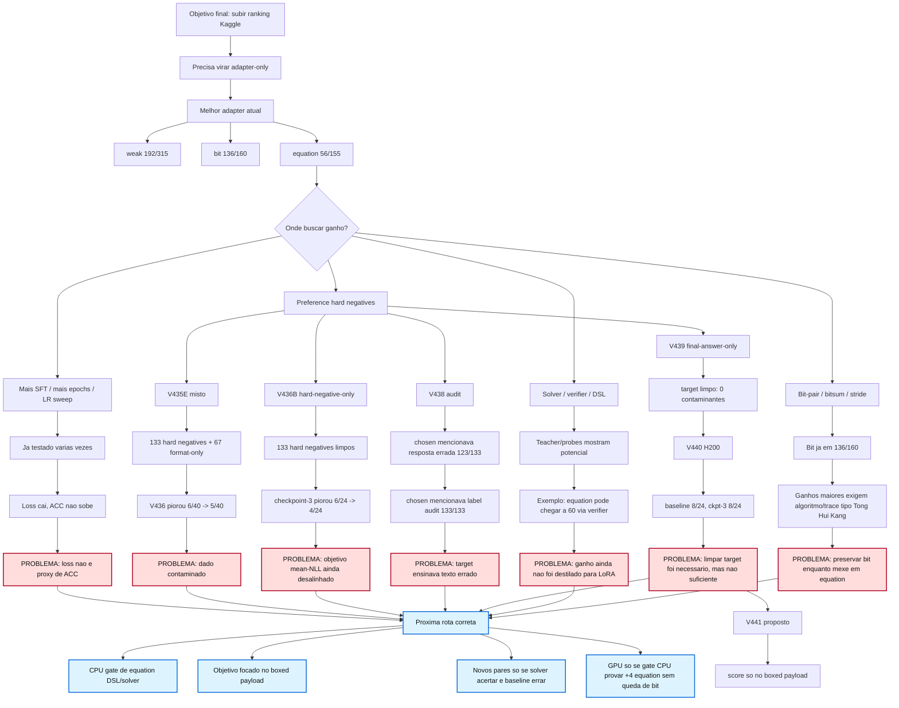

You are an independent senior ML systems auditor and Kaggle competition strategist. You must be concrete, skeptical, and evidence-driven. Do not invent results. If a fact is not supported below, mark it as a hypothesis.

TASK
We need a decision memo for the NVIDIA Nemotron Model Reasoning Challenge solution. We are stuck on a plateau in two weak families: bit_manipulation and equation_transform. We need the fastest responsible path to produce a submit-safe improvement. We specifically need you to audit whether our latest V523/V524 plan is technically correct and what should be done next.

COMPETITION / DATA CONTEXT
- Challenge: NVIDIA Nemotron Model Reasoning Challenge on Kaggle.
- Data fields: train/test have id and prompt; train also has answer.
- Our scoring proxy is a weak gate of 315 rows: 160 bit_manipulation + 155 equation_transform.
- We must avoid leakage from weak/full gate labels into training. Submit-safe means adapter/model behavior, not a hidden verifier/postprocessor unless allowed by the competition packaging and already gate-validated.
- Known stable non-problem families are mostly solved elsewhere; the practical ranking movement comes from small gains on bit_manipulation and equation_transform.

CURRENT MEASURED STATE
- Best submit-safe adapter-only plateau: around 191-192/315 weak.
- Important measured variants:
  - V516 label-free baseline: 191/315, bit=136/160, equation=55/155, trunc=0.
  - V518 from V517 H200 smoke: eval_loss improved 3.2771 -> 3.2720, but weak stayed 191/315 with bit=135/160, equation=56/155, trunc=0. This is a backfire: one equation gain but one bit loss.
  - Label-aware debug can show 192/315, but it is not promotional/submit-safe.
- V519 row diff identified:
  - True equation gain row prompt_sha256 518deb39: prediction changed '{' -> '$'.
  - True bit loss row prompt_sha256 8740ed31: prediction changed '01101000' -> '01111000', bit diff at position 3.
- V520 local candidate mining found no local adapter-only eval CSV beating V516 while preserving bit>=136, trunc=0, and no loss on 8740ed31. Higher 201-222/315 CSVs were solver/postprocessor/integrated, not adapter-submit-safe.

RECENT AUDITS AND FINDINGS
V521 transfer blocker audit:
- V390 equation-only direct GPU blocked.
- V475/V510/V515 already tested and failed as-is.
- V515 has 406/473 bit traces train but unweighted bit share only 18.99%; V518 still lost protected bit row 8740ed31.
- GPU blocked until new CPU transfer signal.

V522 source-target alignment audit:
- Found a reference teacher V380 with 31 no-loss gains over V516 baseline: 23 bit + 8 equation, 0 losses.
- Rule counts among no-loss gains:
  - bit_exact_global_ternary_unique_prediction=13
  - bit_fullbyte_ternary_op_CHO=4
  - bit_fullbyte_ternary_op_MAJ3=4
  - bit_exact_global_binary_OR=1
  - bit_exact_global_binary_XOR=1
  - equation untyped=8
- Source coverage:
  - V304 train has CHO=506, MAJ3=709, PAR3=105, fullbyte=1536, gain-pattern=1056.
  - V515 train has only CHO=4, MAJ3=3, fullbyte=7.
- Decision: source signal found, dataset-build only, no GPU yet.

V523 targeted source trace pack:
- Built source-only dataset from safe source rows, not weak/full labels.
- Valid folder: artifacts/v523_targeted_source_trace_pack/20260516T235821Z
- Train rows=1026, val rows=219.
- Train composition: 706 bit, 320 equation.
- Val composition: 139 bit, 80 equation.
- Buckets train: bit_cho_trace=260, bit_maj3_trace=260, bit_par3_trace=90, bit_v300_gain_pattern_other=96, and 4 equation classes at 80 rows each.
- V286 real tokenization gate passed: max tokens 749, truncation 0, offset masks present for all rows, weak/full overlap 0.
- V513 trace learnability gate passed: 0 blockers, 0 warnings. Combined family/style: 845 bit trace with rule terms, 400 equation short rule reject boxed.
- Initial bug caught and fixed: Python string for oxed accidentally produced backspace via ; corrected to emit literal \boxed.
- Another bug fixed: missing gate_rows_used_for_training=false metadata; now included.

V524 quota/token objective audit:
- V522 reference gain bit share: 23/31 = 0.742.
- V523 row bit share: 0.688109.
- V523 loss-token bit share: 0.906716.
- Loss-token mass: bit=329702, equation=33920.
- Decision: GPU not allowed until objective adjustment. The bit CoT traces dominate the token-level loss, so token_mean loss may drown equation despite equation rows being present.
- Implemented trainer option in scripts/hf_job_train_v90.py:
  - LOSS_NORMALIZATION_MODE env var with values token_mean or example_mean.
  - example_mean computes CE per example normalized by active label-token count, then averages active examples.
  - Training manifest records loss_normalization mode.

CURRENT HYPOTHESIS
The plateau is probably not solved by “more epochs” or lower eval_loss. The metric is exact answer accuracy by family. Token-level loss improvement can be anti-correlated with weak accuracy if long bit traces dominate or if training shifts decision boundaries around fragile rows. We need either:
1) run a tiny gated smoke using V523 + example_mean to test whether objective normalization turns source signal into weak gains, or
2) first rebuild V525 dataset with shorter bit traces / higher equation row mass / hard negatives, then rerun CPU gates and only then GPU.

WHAT WE NEED FROM YOU
Give a ranked, concrete action plan. Focus only on submit-safe improvement for bit_manipulation/equation_transform. Avoid generic ML advice.

Answer these questions directly:
1. Is example_mean the correct next objective correction for V523, or should we prefer family-balanced loss, row weights, shorter bit traces, or a different construction? Rank them.
2. Is V523 safe enough for a short H200 smoke if LOSS_NORMALIZATION_MODE=example_mean, or should we build V525 first? State exact go/no-go criteria.
3. What exact quotas should V525 use if rebuilding? Please propose train/val row ratios and token-mass limits for bit vs equation. Use the measured V522 no-loss gain distribution and V524 token dominance.
4. What kill-switch should stop the job at first checkpoint? Include exact weak thresholds such as bit>=136, equation>=56/57/60, overall>=192/193, no loss on 8740ed31, trunc=0.
5. What additional silent bugs should we test for before any GPU? Include offset-mask, prompt template, answer extraction, family mapping, tokenization, duplicate leakage, and protected row regression checks.
6. How should we interpret low eval_loss but unchanged/worse exact ACC in this setup? Give an actionable diagnostic, not theory only.
7. If you had to choose exactly one next action that maximizes probability of real gain today, what is it?

CONSTRAINTS
- Do not recommend training on weak/full labels or test labels.
- Do not recommend another broad SFT without new CPU signal.
- Do not recommend a Kaggle submit unless weak/full gate shows real measured gain with no regression.
- We can use H200 for <=1 hour if justified, but FinOps rules require canceling if checkpoint metrics are not promising.
- Roadmap must contain only evidence-backed actionable items; unproven ideas must be marked as hypotheses.

LOCAL EVIDENCE: V521 REPORT
# V521 Transfer Blocker Audit

## Decision

- GPU allowed: `False`
- Status: `blocked_until_new_cpu_transfer_signal`
- Reason: V518 showed loss/ACC divergence and V520 found zero submit-safe adapter candidates above baseline. The active datasets are either already failed as-is or have insufficient new bit transfer signal.
- Next action: Build V522 CPU source-target alignment/learnability audit: mine only train/public solver traces, prove new coverage over the protected bit backfire class and at least one equation rule class, then permit GPU only if the no-GPU gate predicts a real label-free gain with bit>=136, trunc=0, and 8740ed31 preserved.

## Why this matters

- V517 reduced loss, but V518 did not improve submit-safe ACC.
- V518 gained one equation row and lost the protected bit row `8740ed31=01101000`.
- V520 found zero local adapter-only CSVs above the label-free baseline without backfire.
- Therefore, another paid job is blocked until a CPU-only transfer gate proves new signal.

## Dataset Summary

| Dataset | Split | Rows | Family counts | Bit traces | Equation traces | Finding |
|---|---:|---:|---|---:|---:|---|
| v390_equation_no_loss_distill | train | 800 | `{"equation_transform": 800}` | 0/0 | 800/800 | blocks direct GPU: equation-only dataset has no bit guardrail rows |
| v390_equation_no_loss_distill | validation | 200 | `{"equation_transform": 200}` | 0/0 | 200/200 | blocks direct GPU: equation-only dataset has no bit guardrail rows |
| v475_equation_bit_replay_mix | train | 1312 | `{"bit_manipulation": 512, "equation_transform": 800}` | 0/512 | 800/800 | already tested: V495/V496 gained equation but lost bit and truncation |
| v475_equation_bit_replay_mix | validation | 328 | `{"bit_manipulation": 128, "equation_transform": 200}` | 0/128 | 200/200 | already tested: V495/V496 gained equation but lost bit and truncation |
| v510_canonical_active_training_pool | train | 2627 | `{"bit_manipulation": 609, "equation_transform": 2018}` | 0/609 | 2018/2018 | blocks as-is: bit trace ratio below 80 percent; already tested: V511/V513 showed no transferable bit trace signal as built |
| v510_canonical_active_training_pool | validation | 637 | `{"bit_manipulation": 133, "equation_transform": 504}` | 0/133 | 504/504 | blocks as-is: bit trace ratio below 80 percent; already tested: V511/V513 showed no transferable bit trace signal as built |
| v515_v514_fullbyte_residual | train | 2491 | `{"bit_manipulation": 473, "equation_transform": 2018}` | 406/473 | 2018/2018 | already tested: V517/V518 lower loss still lost protected bit row; risk: unweighted bit share below 25 percent |
| v515_v514_fullbyte_residual | validation | 620 | `{"bit_manipulation": 116, "equation_transform": 504}` | 97/116 | 504/504 | already tested: V517/V518 lower loss still lost protected bit row; risk: unweighted bit share below 25 percent |
| v304_solver_trace_distill | train | 12822 | `{"bit_manipulation": 4231, "equation_transform": 8015, "gravity_constant": 144, "numeral_system": 144, "text_encryption": 144, "unit_conversion": 144}` | 1536/4231 | 1081/8015 | no structural blocker found by V521 |
| v304_solver_trace_distill | validation | 969 | `{"bit_manipulation": 332, "equation_transform": 573, "gravity_constant": 16, "numeral_system": 16, "text_encryption": 16, "unit_conversion": 16}` | 168/332 | 120/573 | no structural blocker found by V521 |

## Operational Rule

Do not run H200/A100/HF GPU from these datasets as-is. A new job needs a V522-style CPU gate that proves:

1. no exact prompt overlap with weak/full rows;
2. no weak/full training flags;
3. protected row `8740ed31` remains correct in weak eval;
4. label-free total improves beyond baseline;
5. `bit_manipulation>=136`, `equation_transform>55`, and `truncated=0`.

LOCAL EVIDENCE: V522 REPORT
# V522 Source Target Alignment Audit

## Decision

- GPU allowed: `False`
- Dataset build allowed: `True`
- Status: `source_signal_found_dataset_build_only`
- Reason: Reference teacher has no-loss gains, but those gains are not adapter behavior. Use them only to choose source-side trace families; do not train on weak labels.
- Next action: Build V523 targeted source-only trace pack from permitted v304/v515-like sources: prioritize CHO/MAJ3/global ternary bit traces and current V516 label-free equation classes ['274def88', '7688e06e', 'c5b058d6', 'd1bd7478']; then run V286/V513/V521 before any GPU.

## Reference Signal

- No-loss teacher gains: `31`
- Teacher losses vs baseline: `0`
- Gain family counts: `{"bit_manipulation": 23, "equation_transform": 8}`

Top gain rules:

- `bit_manipulation:bit_exact_global_ternary_unique_prediction`: `13`
- `equation_transform:equation_reference_gain_untyped`: `8`
- `bit_manipulation:bit_fullbyte_ternary_op_CHO`: `4`
- `bit_manipulation:bit_fullbyte_ternary_op_MAJ3`: `4`
- `bit_manipulation:bit_exact_global_binary_OR`: `1`
- `bit_manipulation:bit_exact_global_binary_XOR`: `1`

## Source Coverage

| Source | Split | Rows | CHO | MAJ3 | PAR3 | XOR | OR | fullbyte | gain-pattern |
|---|---:|---:|---:|---:|---:|---:|---:|---:|---:|
| v304_solver_trace_distill | train | 12822 | 506 | 709 | 105 | 5034 | 4873 | 1536 | 1056 |
| v304_solver_trace_distill | validation | 969 | 54 | 69 | 17 | 369 | 350 | 168 | 88 |
| v515_v514_fullbyte_residual | train | 2491 | 4 | 3 | 0 | 237 | 238 | 7 | 0 |
| v515_v514_fullbyte_residual | validation | 620 | 0 | 1 | 0 | 57 | 57 | 1 | 0 |

## Rule

The gain rows in this audit are diagnostic targets only. They cannot be copied into training labels. V523 must draw training rows from source-side synthetic/public/train data with no weak/full prompt overlap.

LOCAL EVIDENCE: V524 REPORT
# V524 Quota Token Objective Audit

## Decision

- GPU allowed: `False`
- Status: `objective_adjustment_required`
- Reason: Rows and loss-token mass differ materially; paid GPU must use an objective that prevents token-length bias.
- Next action: Before GPU, either enable row/family-normalized loss or build V525 shorter bit traces, then rerun V286/V513/V524.

## Calculation

- Reference gain bit share: `0.741935`
- V523 row bit share: `0.688109`
- V523 loss-token bit share: `0.906716`
- Loss-token mass: `{"bit_manipulation": 329702, "equation_transform": 33920}`

## Findings

- `warning` `bit_token_share_above_reference_gain_share`: V523 row bit share=0.688, token bit share=0.907, reference gain bit share=0.742. Use row-normalized loss, family weights, or shorter bit traces before GPU.

## Literature Mapping

- Class-balanced loss supports reweighting when row counts do not reflect useful signal.
- Focal/hard-example ideas support emphasizing hard residual classes only when labels are verified.
- Curriculum learning supports short verified traces before harder residual traces.
- Scaling/mixture laws warn that loss movement can be dominated by mixture/token mass rather than target ACC.

LOCAL EVIDENCE: V523 MANIFEST SUMMARY
{
  "version": "V523",
  "generated_at_utc": "2026-05-16T23:58:21.829448+00:00",
  "dataset": null,
  "checks": null,
  "decision": {
    "dataset_ready_for_gates": true,
    "gpu_allowed": false,
    "next_action": "Run V286 boxed_suffix tokenization gate and V513 trace learnability gate; do not run GPU from V523 until both pass.",
    "reason": "V523 is source-only and targeted to V522 no-loss rule families. It still requires V286 tokenization, V513 learnability, V521 transfer blocker, and pre-paid gates before GPU.",
    "status": "dataset_ready_for_cpu_gates"
  },
  "next_action": null
}

LOCAL EVIDENCE: V524 MANIFEST SUMMARY
{
  "decision": {
    "gpu_allowed": false,
    "next_action": "Before GPU, either enable row/family-normalized loss or build V525 shorter bit traces, then rerun V286/V513/V524.",
    "reason": "Rows and loss-token mass differ materially; paid GPU must use an objective that prevents token-length bias.",
    "status": "objective_adjustment_required"
  },
  "findings": [
    {
      "code": "bit_token_share_above_reference_gain_share",
      "detail": "V523 row bit share=0.688, token bit share=0.907, reference gain bit share=0.742. Use row-normalized loss, family weights, or shorter bit traces before GPU.",
      "severity": "warning"
    }
  ],
  "generated_at_utc": "2026-05-17T00:02:16.096482+00:00",
  "outputs": {
    "manifest_json": "artifacts\\v524_quota_token_objective_audit\\v524_quota_token_objective_manifest.json",
    "summary_md": "artifacts\\v524_quota_token_objective_audit\\KG1_V524_QUOTA_TOKEN_OBJECTIVE_AUDIT.md"
  },
  "reference_gain_mix": {
    "bit_manipulation": 23,
    "equation_transform": 8,
    "target_bit_share": 0.741935
  },
  "schema_version": "kg1_v524_quota_token_objective_audit_v1",
  "v523_train_mix": {
    "loss_token_bit_share": 0.906716,
    "loss_token_mass": {
      "bit_manipulation": 329702,
      "equation_transform": 33920
    },
    "row_bit_share": 0.688109,
    "row_family_counts": {
      "bit_manipulation": 706,
      "equation_transform": 320
    }
  },
  "version": "V524"
}

TRAINER LOSS IMPLEMENTATION SNIPPET
#!/usr/bin/env python3
"""
HF Jobs training script V90 - category-solver SFT over the gold-safe corpus.

This script is intended for a single remote A100/H100-class GPU job. The local
workstation used to build the v90 dataset does not have enough GPU/disk headroom
to train NVIDIA-Nemotron-3-Nano-30B-A3B-BF16 directly.

Defaults:
  - Dataset: data/v90/v90_train_gold_safe.jsonl
  - Validation: data/v90/v90_val_gold_safe_stratified.jsonl
  - LoRA: r=32 alpha=32 dropout=0.0, guarded target modules
  - Length: 8192 tokens by default to match the Huikang-style recipe
  - LR: 2e-4 -> 1e-4 linear decay
  - Steps: 300 by default, roughly one epoch at batch size 32

Required env on the remote job:
  HF_TOKEN=<token with read access to model/data and write access to output repo>

Optional env:
  MODEL_NAME, MODEL_REVISION, DATA_REPO, DATA_FILE, VAL_FILE, OUTPUT_REPO, OUTPUT_DIR,
  MAX_LENGTH, BATCH_SIZE, MICRO_BATCH_SIZE, LEARNING_RATE, FINAL_LEARNING_RATE,
  NUM_EPOCHS, MAX_STEPS, SAVE_EVERY_STEPS, EVAL_EVERY_STEPS, EVAL_MAX_EXAMPLES,
  LOG_EVERY_STEPS, MICRO_LOG_EVERY, SEED, EXPECTED_TRAIN_SHA256,
  EXPECTED_VAL_SHA256, MIN_TRAIN_EXAMPLES, MIN_VAL_EXAMPLES,
  MIN_TOKENIZED_TRAIN_EXAMPLES, MIN_TOKENIZED_VAL_EXAMPLES, REQUIRE_OFFSET_MASK,
  LORA_TARGET_MODULES, LORA_TARGET_PARAMETERS, MAX_TRAINABLE_PARAM_RATIO, DRY_RUN_VALIDATE_ONLY,
  TOKENIZE_ONLY_DRY_RUN, UPLOAD_TO_HF,
  UPLOAD_CHECKPOINTS_DURING_TRAINING, SAMPLING_MODE, SUBCATEGORY_WEIGHTS, SOURCE_WEIGHTS,
  TRAINABLE_LORA_MODULES, TRAINABLE_LORA_NAME_SUBSTRINGS,
  REQUIRE_LORA_TARGET_PARAMETER_MATCH, REQUIRED_TRAINABLE_LORA_NAME_SUBSTRINGS,
  ANSWER_SPAN_LOSS_WEIGHT, ANSWER_SPAN_MIN_WEIGHTED_TOKENS
"""

from __future__ import annotations

import gc
import hashlib
import inspect
import importlib.metadata as importlib_metadata
import json
import math
import os
import random
import re
import sys
import time
import warnings
import zipfile
from pathlib import Path
from typing import Any

import torch
import torch.nn.functional as F
from huggingface_hub import HfApi, get_token, hf_hub_download
from peft import LoraConfig, PeftModel, get_peft_model
from peft.utils.save_and_load import load_peft_weights, set_peft_model_state_dict
from transformers import AutoModelForCausalLM, AutoTokenizer

for stream in (sys.stdout, sys.stderr):
    if hasattr(stream, "reconfigure"):
        stream.reconfigure(encoding="utf-8", errors="replace")

os.environ.setdefault("HF_HUB_DISABLE_PROGRESS_BARS", "1")
os.environ.setdefault("TQDM_DISABLE", "1")

def disable_peft_torchao_dispatch_if_incompatible() -> None:
    """Avoid PEFT aborting on stale Colab/Kaggle torchao installs.

    This training path loads the Nemotron base in BF16 and injects ordinary
    LoRA modules. It does not use torchao quantization. Some hosted runtimes
    preinstall old torchao builds; recent PEFT versions probe torchao during
    adapter injection and raise before falling through to the normal dispatch.
    """

    try:
        torchao_version = importlib_metadata.version("torchao")
    except importlib_metadata.PackageNotFoundError:
        return
    except Exception as exc:
        print(f"torchao version probe failed; leaving PEFT dispatch unchanged: {exc}")
        return

    def version_tuple(value: str) -> tuple[int, ...]:
        parts: list[int] = []
        for chunk in value.replace("-", ".").split("."):
            if not chunk.isdigit():
                break
            parts.append(int(chunk))
        return tuple(parts or [0])

    if version_tuple(torchao_version) >= (0, 16, 0):
        print(f"torchao present and compatible enough for PEFT probe: {torchao_version}")
        return

    print(
        "Disabling PEFT torchao dispatcher: "
        f"found torchao=={torchao_version}, but this BF16 LoRA run does not need torchao."
    )

    def _false() -> bool:
        return False

    try:
        import peft.import_utils as peft_import_utils

        if hasattr(peft_import_utils.is_torchao_available, "cache_clear"):
            peft_import_utils.is_torchao_available.cache_clear()
        peft_import_utils.is_torchao_available = _false
    except Exception as exc:
        print(f"Warning: could not patch peft.import_utils torchao probe: {exc}")

    try:
        import peft.tuners.lora.torchao as peft_lora_torchao

        peft_lora_torchao.is_torchao_available = _false
    except Exception as exc:
        print(f"Warning: could not patch peft lora torchao dispatcher: {exc}")

disable_peft_torchao_dispatch_if_incompatible()

def env_int(name: str, default: int) -> int:
    value = os.environ.get(name)
    return default if value in (None, "") else int(value)

def env_float(name: str, default: float) -> float:
    value = os.environ.get(name)
    return default if value in (None, "") else float(value)

def env_str(name: str, default: str) -> str:
    value = os.environ.get(name)
    return default if value in (None, "") else value

def env_bool(name: str, default: bool) -> bool:
    value = os.environ.get(name)
    if value in (None, ""):
        return default
    return value.strip().lower() not in {"0", "false", "no", "off"}

MODEL_NAME = env_str("MODEL_NAME", "nvidia/NVIDIA-Nemotron-3-Nano-30B-A3B-BF16")
MODEL_REVISION = env_str("MODEL_REVISION", "cbd3fa9f933d55ef16a84236559f4ee2a0526848")
MODEL_DEVICE_MAP = env_str("MODEL_DEVICE_MAP", "auto")
ATTN_IMPLEMENTATION = env_str("ATTN_IMPLEMENTATION", "eager")
TORCH_ALLOW_TF32 = env_bool("TORCH_ALLOW_TF32", True)
TORCH_FLOAT32_MATMUL_PRECISION = env_str("TORCH_FLOAT32_MATMUL_PRECISION", "high")
TORCH_DISABLE_CUDNN_SDP = env_bool("TORCH_DISABLE_CUDNN_SDP", False)
TORCH_FORCE_MATH_SDP = env_bool("TORCH_FORCE_MATH_SDP", False)
GRADIENT_CHECKPOINTING = env_bool("GRADIENT_CHECKPOINTING", True)
DATA_REPO = env_str("DATA_REPO", "felipesp1983/kg1-nemotron-training")
DATA_FILE = env_str("DATA_FILE", "data/v90/v90_train_gold_safe.jsonl")
VAL_FILE = env_str("VAL_FILE", "data/v90/v90_val_gold_safe_stratified.jsonl")
PRETOKENIZED_ARCHIVE_ZIP = env_str("PRETOKENIZED_ARCHIVE_ZIP", "")
PRETOKENIZED_EXCLUDE_CATEGORIES = env_str("PRETOKENIZED_EXCLUDE_CATEGORIES", "")
PRETOKENIZED_VAL_EXAMPLES = env_int("PRETOKENIZED_VAL_EXAMPLES", 0)
PRETOKENIZED_VAL_FRACTION = env_float("PRETOKENIZED_VAL_FRACTION", 0.0)
PRETOKENIZED_VAL_COPY_ONLY = env_bool("PRETOKENIZED_VAL_COPY_ONLY", False)
EXPECTED_ARCHIVE_SHA256 = env_str("EXPECTED_ARCHIVE_SHA256", "")
EXPECTED_TRAIN_SHA256 = env_str(
    "EXPECTED_TRAIN_SHA256",
    "ad1c4a1886e92d82d03c0d75c0615ba8c4b96d29e2b07948ff72d541f03c15e4",
)
EXPECTED_VAL_SHA256 = env_str(
    "EXPECTED_VAL_SHA256",
    "749ad2babbfb96c6191b514572e0b1f4aa976681f9a084ee774b3c8f4a44cc04",
)
MIN_TRAIN_EXAMPLES = env_int("MIN_TRAIN_EXAMPLES", 8777)
MIN_VAL_EXAMPLES = env_int("MIN_VAL_EXAMPLES", 720)
MIN_TOKENIZED_TRAIN_EXAMPLES = env_int("MIN_TOKENIZED_TRAIN_EXAMPLES", MIN_TRAIN_EXAMPLES)
MIN_TOKENIZED_VAL_EXAMPLES = env_int("MIN_TOKENIZED_VAL_EXAMPLES", MIN_VAL_EXAMPLES)

MAX_COMPETITION_LORA_R = 32
LORA_R = env_int("LORA_R", 32)
if LORA_R > MAX_COMPETITION_LORA_R:
    raise ValueError(
        f"LORA_R={LORA_R} exceeds competition serving limit "
        f"of {MAX_COMPETITION_LORA_R}."
    )
LORA_ALPHA = env_int("LORA_ALPHA", 32)
LORA_DROPOUT = env_float("LORA_DROPOUT", 0.0)
DEFAULT_LORA_TARGET_MODULES = (
    "down_proj,in_proj,k_proj,lm_head,o_proj,out_proj,q_proj,up_proj,v_proj"
)
LORA_TARGET_MODULES = env_str("LORA_TARGET_MODULES", DEFAULT_LORA_TARGET_MODULES)
LORA_TARGET_PARAMETERS = env_str("LORA_TARGET_PARAMETERS", "")
MAX_TRAINABLE_PARAM_RATIO = env_float("MAX_TRAINABLE_PARAM_RATIO", 0.08)

MAX_LENGTH = env_int("MAX_LENGTH", 8192)
BATCH_SIZE = env_int("BATCH_SIZE", 32)
MICRO_BATCH_SIZE = env_int("MICRO_BATCH_SIZE", 1)
if BATCH_SIZE < MICRO_BATCH_SIZE:
    raise ValueError("BATCH_SIZE must be >= MICRO_BATCH_SIZE")
if BATCH_SIZE % MICRO_BATCH_SIZE != 0:
    raise ValueError("BATCH_SIZE must be divisible by MICRO_BATCH_SIZE")
GRADIENT_ACCUMULATION = BATCH_SIZE // MICRO_BATCH_SIZE

LEARNING_RATE = env_float("LEARNING_RATE", 2e-4)
FINAL_LEARNING_RATE = env_float("FINAL_LEARNING_RATE", 1e-4)
ADAM_BETA1 = env_float("ADAM_BETA1", 0.9)
ADAM_BETA2 = env_float("ADAM_BETA2", 0.95)
ADAM_EPS = env_float("ADAM_EPS", 1e-8)
WEIGHT_DECAY = env_float("WEIGHT_DECAY", 0.0)
GRAD_CLIP_NORM = env_float("GRAD_CLIP_NORM", 1e9)

NUM_EPOCHS = env_int("NUM_EPOCHS", 1)
MAX_STEPS = env_int("MAX_STEPS", 300)
SAVE_EVERY_STEPS = env_int("SAVE_EVERY_STEPS", 50)
EVAL_EVERY_STEPS = env_int("EVAL_EVERY_STEPS", 50)
EVAL_MAX_EXAMPLES = env_int("EVAL_MAX_EXAMPLES", 720)
LOG_EVERY_STEPS = env_int("LOG_EVERY_STEPS", 5)
MICRO_LOG_EVERY = env_int("MICRO_LOG_EVERY", 0)
SEED = env_int("SEED", 90)
MAX_PROMPT_TRUNCATION_RATE = env_float("MAX_PROMPT_TRUNCATION_RATE", 0.10)
SAMPLING_MODE = env_str("SAMPLING_MODE", "shuffle")
VALID_SAMPLING_MODES = {"shuffle", "weighted_replacement"}
if SAMPLING_MODE not in VALID_SAMPLING_MODES:
    raise ValueError(
        "SAMPLING_MODE must be one of "
        f"{sorted(VALID_SAMPLING_MODES)}, got {SAMPLING_MODE!r}."
    )
SUBCATEGORY_WEIGHTS = env_str("SUBCATEGORY_WEIGHTS", "")
SOURCE_WEIGHTS = env_str("SOURCE_WEIGHTS", "")
ANSWER_SPAN_LOSS_WEIGHT = env_float("ANSWER_SPAN_LOSS_WEIGHT", 1.0)
ANSWER_SPAN_MIN_WEIGHTED_TOKENS = env_int("ANSWER_SPAN_MIN_WEIGHTED_TOKENS", 0)
LOSS_NORMALIZATION_MODE = env_str("LOSS_NORMALIZATION_MODE", "token_mean")
VALID_LOSS_NORMALIZATION_MODES = {"token_mean", "example_mean"}
if LOSS_NORMALIZATION_MODE not in VALID_LOSS_NORMALIZATION_MODES:
    raise ValueError(
        "LOSS_NORMALIZATION_MODE must be one of "
        f"{sorted(VALID_LOSS_NORMALIZATION_MODES)}, got {LOSS_NORMALIZATION_MODE!r}."
    )
ABORT_EVAL_LOSS_GT = env_float("ABORT_EVAL_LOSS_GT", 0.0)
BASELINE_EVAL_BEFORE_TRAIN = env_bool("BASELINE_EVAL_BEFORE_TRAIN", False)
ABORT_EVAL_RELATIVE_TO_BASELINE_DELTA = env_float(
    "ABORT_EVAL_RELATIVE_TO_BASELINE_DELTA", -1.0
)
REQUIRE_FINAL_EVAL_LTE_BASELINE = env_bool("REQUIRE_FINAL_EVAL_LTE_BASELINE", False)
MAX_FINAL_EVAL_REGRESSION = env_float("MAX_FINAL_EVAL_REGRESSION", 0.0)
ABORT_TRAIN_RISE_POINTS = env_int("ABORT_TRAIN_RISE_POINTS", 0)
ABORT_MAX_RESERVED_GIB = env_float("ABORT_MAX_RESERVED_GIB", 0.0)
COMPUTE_PROVIDER = env_str("COMPUTE_PROVIDER", "hf_jobs")

OUTPUT_DIR = env_str("OUTPUT_DIR", "/tmp/kg1_v90_output")
OUTPUT_REPO = env_str("OUTPUT_REPO", "felipesp1983/kg1-nemotron-lora-v90-category-solver")
RUN_ID = env_str("RUN_ID", f"v90-r{LORA_R}-a{LORA_ALPHA}-mlen{MAX_LENGTH}-s{MAX_STEPS}")
HF_TOKEN = os.environ.get("HF_TOKEN") or get_token() or ""
INIT_ADAPTER_DIR = env_str("INIT_ADAPTER_DIR", "")
INIT_ADAPTER_REPO = env_str("INIT_ADAPTER_REPO", "")
INIT_ADAPTER_REVISION = env_str("INIT_ADAPTER_REVISION", "")
INIT_ADAPTER_SUBFOLDER = env_str("INIT_ADAPTER_SUBFOLDER", "")
INIT_ADAPTER_LOAD_MODE = env_str("INIT_ADAPTER_LOAD_MODE", "peft")
PEFT_MANUAL_LOAD_METHOD = env_str("PEFT_MANUAL_LOAD_METHOD", "auto")
REQUIRE_OFFSET_MASK = env_bool("REQUIRE_OFFSET_MASK", True)
DRY_RUN_VALIDATE_ONLY = env_bool("DRY_RUN_VALIDATE_ONLY", False)
TOKENIZE_ONLY_DRY_RUN = env_bool("TOKENIZE_ONLY_DRY_RUN", False)
UPLOAD_TO_HF = env_bool("UPLOAD_TO_HF", True)
UPLOAD_CHECKPOINTS_DURING_TRAINING = env_bool("UPLOAD_CHECKPOINTS_DURING_TRAINING", False)
FAIL_ON_MISSING_ADAPTER_KEYS = env_bool("FAIL_ON_MISSING_ADAPTER_KEYS", True)
TRAINABLE_LORA_MODULES = env_str("TRAINABLE_LORA_MODULES", "")
TRAINABLE_LORA_NAME_SUBSTRINGS = env_str("TRAINABLE_LORA_NAME_SUBSTRINGS", "")
REQUIRE_LORA_TARGET_PARAMETER_MATCH = env_bool("REQUIRE_LORA_TARGET_PARAMETER_MATCH", False)
REQUIRE_LORA_TARGET_PARAMETERS_TRAINABLE = env_bool("REQUIRE_LORA_TARGET_PARAMETERS_TRAINABLE", False)
REQUIRED_TRAINABLE_LORA_NAME_SUBSTRINGS = env_str("REQUIRED_TRAINABLE_LORA_NAME_SUBSTRINGS", "")
ADAPTER_LOAD_TORCH_DEVICE = env_str("ADAPTER_LOAD_TORCH_DEVICE", "")
ADAPTER_LOAD_LOW_CPU_MEM_USAGE = env_bool("ADAPTER_LOAD_LOW_CPU_MEM_USAGE", False)
USE_BITSANDBYTES = env_bool("USE_BITSANDBYTES", True)

def optional_torch_device(value: s
[TRUNCATED]

STATIC GATE SNIPPET
#!/usr/bin/env python3
"""Static safety gate for KG1 scripts, HF job launchers, and notebooks.

This gate catches repository-level regressions that are cheaper to block before
running Colab, HF Jobs, or paid GPU work. It is intentionally conservative for
training/preference files: format-only negatives are allowed only in diagnostic
builders/gates, never in active HF jobs or notebooks.
"""

from __future__ import annotations

import argparse
import json
import re
import subprocess
import sys
import tempfile
from dataclasses import dataclass
from pathlib import Path
from typing import Any

ROOT = Path(__file__).resolve().parents[1]

OLD_MIXED_V435E_PATH = "data/v435e_adapter_probe_preference/20260515T_v435e_from_h200_probe"
OLD_MIXED_V435E_TRAIN_SHA = "7f5e11770ac09c15e695cf4690df2fe7b5985b4a8b5bf5f8a201e8b71fe8be81"
OLD_MIXED_V435E_VAL_SHA = "d66752ab8470e145744a8bf80bc9b8beab7a4a3479d9161d03d6cc61c8ff9d92"

CRITICAL_SNIPPETS = {
    "scripts/build_v435e_adapter_probe_preference_dataset.py": {
        "correct rows excluded by default": "Correct adapter rows are not included by default",
        "diagnostic flag only": "--include-format-negatives",
        "include flag manifest": "\"include_format_negatives\": args.include_format_negatives",
        "format diagnostic warning": "format-only negatives are useful for a format audit",
    },
    "scripts/run_v435f_adapter_probe_preference_gate.py": {
        "format absence condition": "format_negatives_absent_for_preference",
        "allow flag": "--allow-format-negatives",
        "format row count": "format_negative_rows",
        "default hard-only path": "20260515T_v435e_hardneg_only",
    },
    "scripts/hf_job_train_v315_preference.py": {
        "format default false": "ALLOW_FORMAT_NEGATIVES = env_bool(\"ALLOW_FORMAT_NEGATIVES\", False)",
        "format rows blocked": "format_negative_blocked",
        "negative type accuracy": "negative_type_accuracy",
        "negative type from tokenized pair": "pair.get(\"negative_type\")",
        "boxed payload score modes": "BOXED_PAYLOAD_SCORE_MODES",
        "payload-only score mask": "build_boxed_payload_loss_mask",
        "score mask manifest": "\"score_mask_key\": score_mask_key()",
    },
    "scripts/kg1_pre_paid_job_integration_gate.py": {
        "dataset content audit": "audit_dataset_file",
        "target template check": "Final answer: \\\\boxed{",
        "blocked dataset marker gate": "BLOCKED_DATASET_MARKERS",
        "blocked adapter marker gate": "BLOCKED_ADAPTER_MARKERS",
        "data repo gate": "expected_data_repo",
        "command data repo export gate": "launcher_command_data_repo_export_mismatch",
        "crisis backfire guard": "launcher_missing_crisis_backfire_guard",
        "audit manifest gate": "hf_gpu_allowed_for_same_objective",
        "system prompt alignment gate": "launcher_system_prompt_not_final_answer_only",
        "h200 timeout gate": "launcher_timeout_not_one_hour",
        "first checkpoint eval gate": "launcher_missing_first_checkpoint_eval",
        "format negatives blocked": "launcher_allows_format_negatives",
    },
    "scripts/kg1_weak_backfire_row_guard.py": {
        "known bit backfire id": "8740ed31=01101000",
        "protected id blocker": "protected_id_backfire",
        "loss not promotion comment": "Loss movement alone is not actionable",
        "self test ok marker": "kg1_weak_backfire_row_guard_self_test=ok",
    },
    "scripts/audit_v521_transfer_blockers.py": {
        "loss acc divergence finding": "V518 showed loss/ACC divergence",
        "no hidden adapter candidate": "zero submit-safe adapter candidates",
        "gpu blocked fail closed": "\"gpu_allowed\": False",
        "v522 next action": "V522 CPU source-target alignment",
        "self test ok marker": "audit_v521_transfer_blockers_self_test=ok",
    },
    "scripts/audit_v522_source_target_alignment.py": {
        "reference gains are diagnostic": "They cannot be copied into training labels",
        "gpu blocked fail closed": "\"gpu_allowed\": False",
        "dataset build only status": "source_signal_found_dataset_build_only",
        "teacher signal total": "gain_total",
        "self test ok marker": "audit_v522_source_target_alignment_self_test=ok",
    },
    "scripts/audit_v524_quota_token_objective.py": {
        "row token distinction": "Rows are not the same as optimization weight",
        "token bias blocker": "objective_adjustment_required",
        "loss token bit share": "loss_token_bit_share",
        "self test ok marker": "audit_v524_quota_token_objective_self_test=ok",
    },
    "scripts/hf_job_preflight_gate.py": {
        "strict target modules check": "Init adapter target_modules mismatch",
        "strict target parameters check": "Init adapter target_parameters mismatch",
        "target parameter require check": "Init adapter has target_parameters but REQUIRE_LORA_TARGET_PARAMETER_MATCH is disabled",
        "gate row contamination flag": "weak_gate_rows_used_for_training",
        "gate row contamination fail": "gate/full/weak rows used for training",
        "missing gate flags fail": "missing required anti-leakage gate flags",
    },
    "scripts/hf_job_train_v90.py": {
        "target parameter alias matcher": "def target_parameter_name_matches",
        "gate-up alias target": "experts.gate_up_proj",
        "gate-up alias live name": ".up_proj.",
        "down alias live name": ".down_proj.",
        "target parameter trainability env": "REQUIRE_LORA_TARGET_PARAMETERS_TRAINABLE",
        "target parameter trainability tensors": "target_parameter_trainable_lora_tensors",
        "target parameter trainability mode": "target_parameters_trainability_mode",
        "manifest trainable filter report": "trainable_lora_module_filter",
        "default max length official": "MAX_LENGTH = env_int(\"MAX_LENGTH\", 8192)",
        "loss normalization mode": "LOSS_NORMALIZATION_MODE",
        "example mean loss mode": "\"example_mean\"",
        "loss normalization manifest": "\"loss_normalization\"",
    },
    "scripts/package_hf_adapter_submission.py": {
        "official-like manifest schema required": "OFFICIAL_LIKE_SCHEMA_VERSION",
        "package threshold aligned": "--min-full-correct\", type=int, default=831",
        "immutable revision required": "missing immutable revision/resolved_revision",
        "adapter config hash check": "adapter_config sha mismatch",
        "adapter model hash check": "adapter_model sha mismatch",
        "official postprocessor rejected": "submission package cannot rely on external prediction postprocessor",
        "official-like control required": "full manifest missing official_like_control_gate",
        "official-like strict required": "official-like strict",
        "official gpu utilization required": "official-like gpu_memory_utilization",
        "manifest commit required": "full manifest missing repo_commit",
    },
    "src/competition_utils.py": {
        "expected-a
[TRUNCATED]

ROADMAP / PROBLEM MAP CONTEXT
# KG1 Problem Map

Atualizado: 2026-05-15

Este documento mostra onde a solucao esta travando, quais evidencias temos e
por que a proxima acao nao deve ser "treinar mais", mas sim mudar o objetivo ou
o dado antes de gastar GPU novamente.

## Resumo Executivo

O problema atual nao e infraestrutura, GPU, hash, tokenizacao ou carregamento do
adapter. Esses pontos foram validados. O problema esta no **sinal de aprendizado
que chega ao LoRA**.

Estado real submit-safe:

| Metrica | Melhor adapter-only atual |
|---|---:|
| weak total | `192/315` |
| `equation_transform` | `56/155` |
| `bit_manipulation` | `136/160` |
| truncation | `0` |

O que ja sabemos:

- `bit_manipulation` ja esta forte no weak: `136/160`.
- `equation_transform` e o gargalo principal: `56/155`.
- V436/V436B/V440 provaram que preference `mean_nll` nao esta gerando ganho
  submit-safe.
- V441 provou que focar o score somente no payload do `\boxed{...}` tambem nao
  gera sinal no primeiro checkpoint.
- V442 provou que os `133` pares V439 sao source-ok, mas `0/133` possuem
  certificado de regra label-free. O problema deixou de ser formato/loss e
  virou falta de regra congelada transferivel para o adapter.
- Solver/verifier/teacher mostrou potencial, mas esse ganho ainda nao foi
  convertido para adapter-only.
- Apos V441/V442, novo smoke defensavel exige dado novo com certificado CPU,
  nao apenas troca de loss, LR, epoch ou H200.

## Desenho Simples Das Pecas Principais

Esta visao mostra somente as pecas centrais. O ponto critico esta entre
`conhecimento verificado` e `LoRA adapter`: hoje conseguimos encontrar respostas
potenciais fora do adapter, mas ainda nao conseguimos transformar isso em pesos
que melhorem o weak gate sem regressao.

## Desenho Do Problema

## Onde Estamos Com Problema

### 1. `equation_transform` e o gargalo real

O weak atual mostra:

- `bit_manipulation`: `136/160`, no piso submit-safe atual de `136`.
- `equation_transform`: `56/155`, abaixo da meta operacional de `60`.
- Total: `192/315`, ainda sem margem para promover full/package com seguranca.

Isso significa que o ranking nao vai subir apenas preservando bit. Precisamos
de pelo menos alguns acertos novos em equation, sem perder bit.

### 2. Loss baixo nao resolveu a metrica que importa

Observacao acumulada:

- varios treinos reduziram `train_loss` ou `eval_loss`;
- os acertos de `equation_transform` ficaram presos em torno de `56`;
- algumas variantes ainda derrubaram bit.

Conclusao: `loss` serve para detectar treino numericamente saudavel, mas nao
serve para promover checkpoint. O gate real segue sendo weak/full por familia.

### 3. Preference hard-negative falhou em duas formas

#### V436: dataset misto

O V435E antigo tinha:

- `133` hard negatives;
- `67` format-only negatives.

Resultado V436:

| Metrica interna | Baseline | Checkpoint inicial |
|---|---:|---:|
| preference total | `6/40` | `5/40` |
| equation | `4/22` | `3/22` |

Diagnostico: o dataset misturava negativos semanticamente errados com negativos
apenas de formato. Isso contaminava o sinal.

#### V436B: hard-negative-only

Corrigimos para apenas hard negatives:

- `133` pares;
- `120` equation;
- `13` bit.

Resultado:

| Metrica interna | Baseline | Checkpoint-3 |
|---|---:|---:|
| preference total | `6/24` | `4/24` |
| equation | `4/22` | `2/22` |
| bit | `2/2` | `2/2` |

Diagnostico: mesmo com dado sem format-only, o objetivo `mean_nll` ainda moveu
equation na direcao errada.

### 4. O target escolhido tambem estava contaminado

V438 audit encontrou:

| Check | Resultado |
|---|---:|
| labels boxed semanticamente corretos | `133/133` |
| rejected igual ao adapter wrong | `133/133` |
| chosen menciona adapter prediction errado | `123/133` |
| chosen menciona public-train label audit | `133/133` |

Diagnostico: o label final estava correto, mas o texto de treino ensinava coisas
ruins junto: mencionava auditoria e repetia a resposta errada.

### 5. V439 corrigiu o texto, mas V440 mostrou que isso nao basta

V439 final-answer-only removeu a contaminacao:

- chosen: `Final answer: \boxed{ANSWER}`;
- rejected: `Final answer: \boxed{ADAPTER_WRONG}`;
- `chosen_mentions_adapter_prediction_rows=0`;
- `chosen_mentions_public_train_label_audit_rows=0`.

V440 H200 validou toda a infraestrutura:

- integration gate local/remoto OK;
- HF dataset correto e hashes batendo;
- tokenizacao sem truncation;
- offset masks OK;
- adapter inicial V290 checkpoint-6 carregado `12011/12011`;
- trainable LoRA `8,015,872` parametros, `0.0247%`.

Resultado V440:

| Metrica interna V439 validation | Baseline V290 ckpt-6 | V440 checkpoint-3 |
|---|---:|---:|
| preference total | `8/24` | `8/24` |
| equation | `7/22` | `7/22` |
| bit | `1/2` | `1/2` |

Decisao: cancelado por FinOps. Nao houve sinal material para weak/full.

Diagnostico: limpar o target era necessario, mas o objetivo `mean_nll` sobre a
sequencia curta ainda nao e forte o bastante para converter os acertos desejados
em comportamento do adapter.

### 6. Consulta API sobre V441

Consulta feita em 2026-05-15 via OpenRouter:

- `deepseek/deepseek-v3.2`: V441 e tecnicamente justificado, mas com ressalva
  de que payload-only pode nao corrigir raciocinio.
- `qwen/qwen3.6-max-preview`: V441 e a correcao mecanica direta para a diluicao
  de sinal da V440.
- `google/gemini-3.1-pro-preview`: resposta truncada, mas iniciou validando a
  mesma tese de diluicao de sinal.

Conclusao atualizada: V441 ja foi executado e cancelado. Nao deve ser repetido.
Ele testou a hipotese de diluicao da loss em tokens de boilerplate e nao trouxe
sinal interno suficiente para weak/full.

Preflight local V441:

- Compile, gate estatico e gate pre-pago: OK.
- Tokenize-only dry-run: treino `109/109`, validacao `24/24`.
- Truncation e fallback de offset mask: `0`.
- Mascara de score no payload nao vazia: treino `chosen=339`, `rejected=376`;
  validacao `chosen=75`, `rejected=78`.

Resultado V441:

| Metrica interna V441 validation | Baseline V290 ckpt-6 | V441 checkpoint-3 |
|---|---:|---:|
| preference total | `7/24` | `7/24` |
| equation | `6/22` | `6/22` |
| bit | `1/2` | `1/2` |

Decisao: cancelado por FinOps. A implementacao do payload mask funcionou, mas
nao houve sinal interno para weak/full.

### 7. Auditoria V442 pos-V441

Resultado:

| Item | Valor |
|---|---:|
| pares V439 auditados | `133` |
| source-ok rows | `133` |
| weak/full training rows | `0` |
| rule-certified rows | `0` |

Conclusao: o dataset V439 e limpo como diagnostico, mas insuficiente para novo
treino pago. Ele nao traz `rule_unique_label_free`, `program_or_rule`,
`mdl_score`, `leave_one_out_pass`, `renaming_stability_pass`,
`slot_alignment_stats` nem `rule_frozen_before_answer`.

Decisao: bloqu
[TRUNCATED]

OUTPUT FORMAT REQUIRED
Return exactly these sections:
- Verdict
- Ranked Next Actions
- Exact V525/V526 Configuration
- Kill-Switch / Gates
- Silent Bug Checklist
- Expected Gain / Risk
- What Not To Do
- One-Sentence Decision