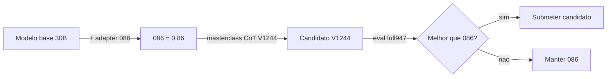
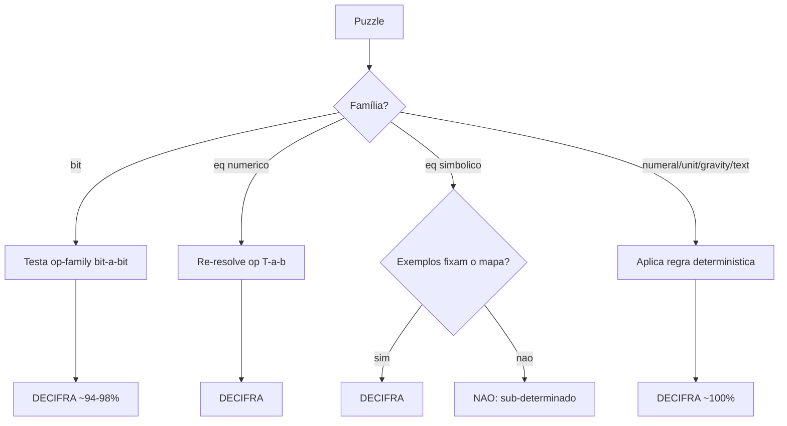
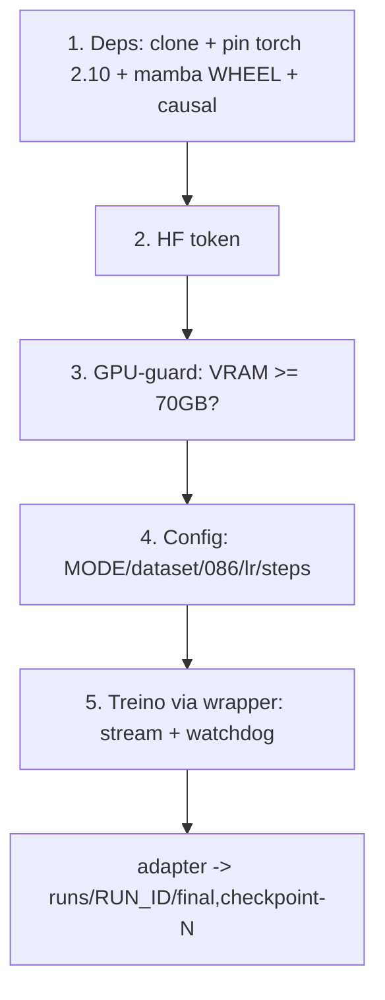
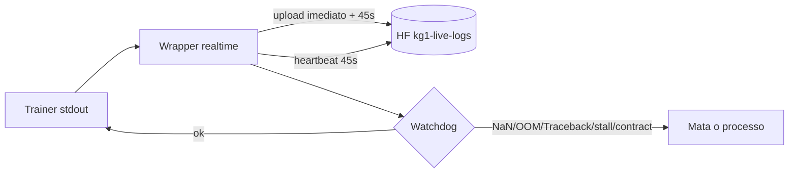
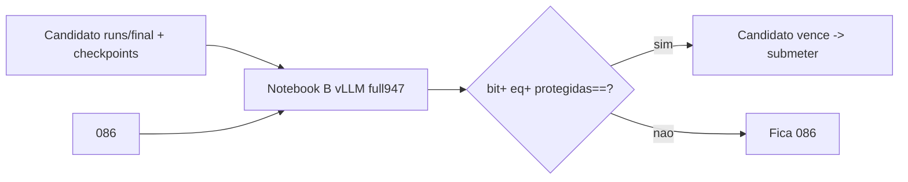

# 📘 Documentação Completa — Solução KG1 V1244 (NVIDIA Nemotron Reasoning Challenge)

> Documento único, didático e técnico. Explica **o desafio, a solução, como cada puzzle é
> decifrado, o pipeline de treino linha a linha, o monitoramento, a avaliação e as versões** —
> com **exemplos resolvidos** e **fluxogramas**. Companheiro divertido: [A Pizzaria do Seu Nemotron](A_PIZZARIA_DO_SEU_NEMOTRON_use_a_cabeca.md).

Índice:
1. [Visão geral e objetivo](#1)
2. [Arquitetura da solução](#2)
3. [As 6 famílias de puzzle — como decifrar (com exemplos)](#3)
4. [Camada de dados (dataset V1244)](#4)
5. [Pipeline de treino — célula a célula](#5)
6. [Monitoramento, gates e segurança](#6)
7. [Avaliação (o juiz real)](#7)
8. [Compatibilidade de versões](#8)
9. [Glossário e recap](#9)

---

<a name="1"></a>
## 1. Visão geral e objetivo

- **Competição:** NVIDIA Nemotron Reasoning Challenge (Kaggle).
- **Objetivo:** maximizar o **score** (TOP 1) = média de acertos num teste **oculto** de puzzles.
- **Regra-chave:** entregar um **adapter LoRA (rank ≤ 32)** sobre o modelo base; avaliação por
  **geração greedy + boxed exact-match**.
- **Onde estamos:** o adapter **086 = 0.86** é o piso provado. A **V1244** é uma masterclass curta
  (CoT) pra subir o **bit** sem estragar o resto.



---

<a name="2"></a>
## 2. Arquitetura da solução

| Item | Valor | Observação |
|---|---|---|
| Modelo base | `nvidia/NVIDIA-Nemotron-3-Nano-30B-A3B-BF16` (rev `cbd3fa9`) | híbrido **23 Mamba + 6 Atenção + 23 MoE** (52 camadas, 128 experts) |
| Adapter | LoRA **r=32, α=32** | alvos: `q/k/v/o/in/up/down_proj` (só lineares) → **strip-safe** |
| Treináveis | **2.71%** dos parâmetros | validado no model-dryrun |
| Warmstart | adapter **086** | parte do que já é 0.86 |
| Métrica oficial | temp **0.0**, top_p 1.0, `max_tokens=7680`, `max_model_len=8192`, rank ≤ 32 | boxed exact-match por item |
| Score | média de acertos em **947 itens / 6 famílias** | bit160·unit159·gravity159·text157·numeral157·eq155 |

> 💡 **A grande sacada:** o cálculo pesado é **Mamba + MoE (46 de 52 camadas)** — irredutível.
> A atenção é só 6/52. Por isso trocar kernel de atenção rende ~1-2% (marginal).

---

<a name="3"></a>
## 3. As 6 famílias de puzzle — como decifrar (com exemplos)

> Marco **[MEDIDO]** = número verificado; **[ilustrativo]** = exemplo didático que montei.



### 3.1 `bit_manipulation` — ✅ DECIFRÁVEL (determinístico)
Uma **regra fixa** de 8 bits feita de: `shift, rotação, NOT, espelhar, XOR/AND/OR/XNOR/NAND/NOR, majority, choice, mod-256`.

**Como decifrar:** testar cada operador candidato e ver qual bate em **todos** os exemplos.

**Exemplo resolvido [ilustrativo] — XOR com máscara:**
```
00001111 -> 10100101   ⇒ máscara = 00001111 XOR 10100101 = 10101010
11110000 -> 01011010   ⇒ máscara = 11110000 XOR 01011010 = 10101010   (mesma!)
REGRA: saída = entrada XOR 10101010
Query: 11001100 XOR 10101010 = 01100110   ✅
```
**Veredito:** ✅ **~94-98%** **[MEDIDO: solver 94.4% train / 98.6% régua]**. Escapa ~18% com operador
fora da família (`q_op_unseen`). Erros do 086 = classes **d2/3/b** → **alvo do CoT V1244**.

### 3.2 `equation_transform` NUMÉRICO — ✅ DECIFRÁVEL
Estrutura `T(op(T(a),T(b)))`, `T`∈{id,espelhar}, `op`∈{soma,sub,mult,**absdiff**,±1,concat}.

**Exemplo resolvido [MEDIDO — puzzle real `}30`]:**
```
65}27 = }38 ;  11}59 = }48 ;  46}23 = }23
Descobre: a}b = "}" + |a-b|   (o "}" é formatação; a conta é diferença absoluta)
Query: 28}58 ⇒ |28-58| = 30 → }30   ✅
```
**Veredito:** ✅ decifrável (re-resolve a op-family + confirma nos exemplos).

### 3.3 `equation_transform` SIMBÓLICO — 🟡 ÀS VEZES NÃO
Números viram **glifos**; **cada puzzle tem seu mapa glifo→dígito**.
```
Ex [ilustrativo]: ◆▲ ⊕ ●◆ = ▲◆●   (1 exemplo só)
1 equação, várias incógnitas (◆,▲,●,op) → SUB-DETERMINADO → vários mapas explicam o mesmo exemplo.
```
**Decifra quando:** há exemplos suficientes, ou dá pra reverter o **gerador** + síntese + desambiguação.
**Veredito:** 🟡 **~45%** **[MEDIDO: solver v2 held-out 45.3%]**. `q_unseen` (~13) = **cofre sem chave** (perdido). É o **teto** da família.

### 3.4–3.6 Protegidas — ✅ DECIFRÁVEIS (086 já ~100%)
```
numeral_system   XLII = 42 ; 101101₂ = 45                 ✅
unit_conversion  3.5 km = 3500 m ; 2 h = 7200 s            ✅
gravity_constant fórmula física (peso/força com g dado)   ✅
text_encryption  "KHOOR" -(César −3)→ "HELLO"             ✅
```
**Veredito:** ✅ determinísticas; **[MEDIDO: 086 ~100% nas 4]** → o treino só precisa **não estragar** (replay 30%).

### 🗺️ Mapa honesto do jogo
```
JÁ GANHO (proteger): numeral · unit · gravity · text
GAP (subir):         bit (classes d2/3/b)  +  eq numérico
PERDIDO (teto):      eq simbólico q_unseen (~13)
```

---

<a name="4"></a>
## 4. Camada de dados (dataset V1244)

| Métrica | Valor | Status |
|---|---|---|
| Linhas | **979** (262 bit-CoT + 423 eq_num + 294 protegidas/replay) | [VERIFICADO] |
| Leak vs full947 | **0** (por id e por prompt) | [VERIFICADO] |
| Métrica oficial nas 979 | **0 falhas** (extract+verify por família) | [VERIFICADO] |
| Think-wrap | assistant continua o `<think>` do prompt, fecha `</think>`, termina `\boxed{}` | [VERIFICADO] |
| EOS | `<|im_end|>` na região de loss (modelo aprende a parar) | [VERIFICADO] |
| Tokens | máx **1670** (< 6144) → 0 truncado | [VERIFICADO] |
| Suffix oficial | presente em 979/979; eval adiciona o mesmo (sem duplicar) | [VERIFICADO] |

> 💡 **Replay 30%:** as 4 famílias protegidas são re-mostradas pro modelo **não esquecer** o que já
> acerta (~100%). É o cinto de segurança contra "aprender bit e esquecer unidade".

---

<a name="5"></a>
## 5. Pipeline de treino — célula a célula



**Resumo técnico (a versão divertida está na [Pizzaria](A_PIZZARIA_DO_SEU_NEMOTRON_use_a_cabeca.md)):**
- **Cél 1 (deps):** clona a branch (`check=True`); **fixa `torch==2.10` (cu126)** porque o Colab veio
  com 2.11 (sem wheel do mamba); instala **mamba via wheel (~10s)**; **assert CUDA** + **import assert**.
- **Cél 2 (token):** lê `HF_KEY` do Colab Secrets; `assert` se faltar.
- **Cél 3 (GPU-guard):** mede VRAM; **aborta cedo** se < 70GB (o 30B precisa ~60GB → 40GB = OOM).
- **Cél 4 (config):** `MODE='SMOKE'` (8 steps) / `'REAL'` (160 steps via `NUM_EPOCHS=6`); dataset 979;
  warmstart **086**; `lr 5e-6→1e-6`; `REQUIRE_INIT_ADAPTER` + `REQUIRE_OFFSET_MASK` (gates).
- **Cél 5 (treino):** roda o trainer **via wrapper** (`kg1_colab_realtime_runner.py`) → streaming + watchdog.

**Matemática dos steps [VERIFICADO]:** `epoch_steps = ceil(979/32) = 31`; `REAL: 31 × 6 epochs = 186 → cap 160`.
*(Com 1 epoch rodaria só 31 — por isso NUM_EPOCHS=6.)*

---

<a name="6"></a>
## 6. Monitoramento, gates e segurança



**Os 8 portões fail-loud (erro silencioso = eliminado):**
```
1. clone check=True            5. REQUIRE_INIT_ADAPTER (086)
2. import assert (mamba)        6. REQUIRE_OFFSET_MASK (máscara)
3. HF_TOKEN assert             7. require_live_log (smoke: valida stream)
4. GPU VRAM assert             8. watchdog (NaN/OOM/stall/contract)
```
**Visibilidade total:**
- **Upload imediato (canário):** log aparece no HF em ~2s — crash rápido (<60s) **não fica invisível**.
- **Heartbeat (45s):** pulso mesmo em fase silenciosa (load do 30B); `last_output_age_s` mostra
  travamento **crescendo antes** do watchdog matar.
- **Watchdog preciso:** regex só dispara em **erro real** (`^Traceback`, `^XxxError:`, `CUDA out of
  memory`, `FloatingPointError`, `Non-finite ...`) — **sem falso-positivo** (a causa do RC=241 antigo).

| Erro possível | Pego? | Visível? |
|---|---|---|
| CUDA OOM | ✅ regex + GPU-guard | ✅ |
| NaN/Inf | ✅ trainer raise | ✅ |
| Exceção Python | ✅ Traceback | ✅ |
| Travamento/stall | ✅ watchdog 45min + heartbeat | ✅ |
| Falso-positivo | 🔴→✅ corrigido | — |
| Colab desconecta | ⚠️ externo | ✅ status.json congela |

---

<a name="7"></a>
## 7. Avaliação (o juiz real)

- **Notebook B** roda `evaluate_lora_adapter.py` com **vLLM** (config oficial) no **full947**.
- Compara **086 (piso)** vs **candidato** (acha o adapter em `runs/<RUN_ID>/{final,checkpoint-N}`).
- Métrica idêntica à oficial (paridade `competition_utils` verificada).
- **Loss caindo ≠ score subindo:** o `SCORE_TRAJECTORY` do treino é **teacher-forced** (termômetro),
  o **juiz de verdade** é o Notebook B (geração real).



---

<a name="8"></a>
## 8. Compatibilidade de versões [VERIFICADO via PyPI]

| Pacote | Exige torch | Papel |
|---|---|---|
| transformers 4.57.6 | `>=2.2` | serve NemotronH + vLLM (não 5.x) |
| peft 0.19.1 | `>=1.13` | LoRA |
| accelerate 1.13.0 | `>=2.0` | treino |
| mamba-ssm 2.3.1 | wheel p/ 2.10 | kernels Mamba |
| **vllm 0.19.1** | **`==2.10.0` (exato)** | eval |

> 🎯 **torch 2.10.0** é o **ponto de convergência**: é o pin EXATO do vLLM, o alvo do wheel do mamba,
> e satisfaz o transformers. Pinar 2.10 **alinha treino e eval** no mesmo torch. **São as melhores
> versões compatíveis** (não trocar: vLLM exclui transformers 5.x; 4.57.6 é o necessário p/ NemotronH).

---

<a name="9"></a>
## 9. Glossário e recap

| Termo | Em 1 frase |
|---|---|
| Adapter / LoRA | "tempero" treinável por cima do chef 30B (rank ≤ 32) |
| 086 | o adapter base, nota 0.86 (warmstart) |
| CoT | cadeia de raciocínio (o `<think>...`) que ensina a decifrar |
| wheel | pacote pré-compilado (instala em ~10s vs 30min) |
| watchdog | vigia que mata o job em erro/travamento |
| canário | upload imediato do log (visibilidade desde o 1º segundo) |
| full947 | 947 puzzles canônicos = o juiz real |

**Recap em 5 linhas:**
```
1. Modelo 30B + adapter 086 (0.86). V1244 = masterclass CoT pra subir bit sem estragar o resto.
2. Decifrável: bit (~95%), eq numérico, e as 4 protegidas (~100%). Teto: eq simbólico q_unseen.
3. Treino: torch 2.10 + mamba wheel + warmstart 086 + 160 steps + 4 checkpoints.
4. Segurança: 8 portões fail-loud + canário + heartbeat + watchdog preciso.
5. Juiz real: Notebook B (full947, vLLM, métrica oficial). Loss ≠ score.
```

---
*Gerado por Claude — documentação viva. Versão divertida: [A Pizzaria do Seu Nemotron](A_PIZZARIA_DO_SEU_NEMOTRON_use_a_cabeca.md).*
